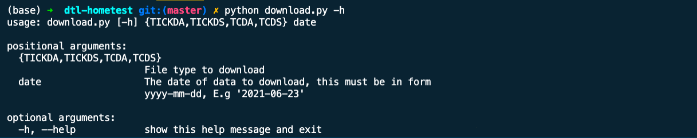

# Dynamic Technology Lab Home-Test

This is the answer for the home-test from DTL

## Description

Create a program for auto download files from [this site](https://www.sgx.com/research-education/derivatives)

## Getting Started

### Dependencies

* Mac or Linux (not yet tested on windows)
* Python >= 3.7
* argparse, zipfile, logging, request, datetime packages installed
### Executing program

* Clone the project, change directory to project folder
* Run the command below for downloading a specific file type and date
```
python download.py TICKDA 2021-06-11
```
* You can pass any date you want and see if the file available on the server.
## Help

You can use the command -h to get help if needed:
```
python download.py -h
```



FYI, files download are saved in corresponding date folder.

* TICKDA is for download WEBPXTICK_DT_*.zip file .
* TICKDS is for download TickData_structure.dat file.
* TCDA is for download TC_*.txt file.
* TCDS is for download TC_structure.date file.

## Run schedule and Recovery Plan

* For daily download file, we should use a tool like Airflow, which is a tool for scheduling and recovery. It has the feature that could help us auto retry the task if it is failed. We should build a DAG and give it a schedule to run daily download for all 4 types of files.

* We can set some alerts if Airflow can't get the job done for some retries.

* It's possible for us to download older files, it's a feature of this program, use can try to download file from 2020 ^^!

## Concerns and Solutions

* In this program, I had cover so many potential bugs like check the input date, check download file type,
check valid of a zip file, check file corrupted, check the internet connection, check file available on server and extend the feature for download any file from older dates.
* Some concerns like the link for download files may be change, so we should correspondingly change our link in **get_download_info** function to get a proper link to download.

## Authors
* [Duy Trinh](https://www.linkedin.com/in/baduy9x/)
